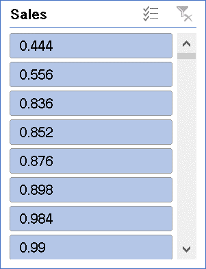

# Excel Superstore Sales Analysis Dashboard

## Project Overview
This project is an interactive Excel dashboard created using Superstore sales data.

The dashboard helps analyze:
- Sales performance
- Profit trends
- Regional analysis
- Category-wise insights

---

## Tools Used
- Microsoft Excel
- Pivot Tables
- Pivot Charts
- Slicers
- Conditional Formatting
- Data Cleaning

---

## Key Insights
- Identified top-performing regions
- Analyzed monthly sales trends
- Compared category-wise profits
- Interactive filtering using slicers

---

## Dashboard Preview

---

## Project File
Download the Excel dashboard file from this repository.

